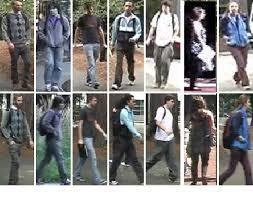
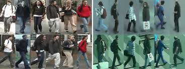
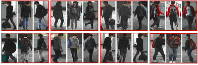
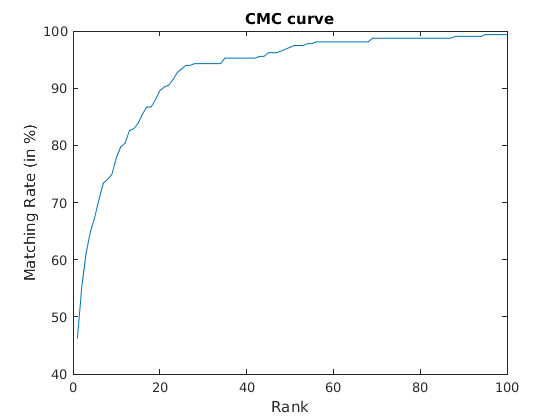

# Subspace-Learning-for-Person-Re-identification

### Dataset: VIPeR

### Dataset: VIPeR (Left) + PRID450S (Right)

### Dataset: CUHK01

### Algorithm 1: LOMO + Subspace Learning ( Dataset used: VIPeR )

